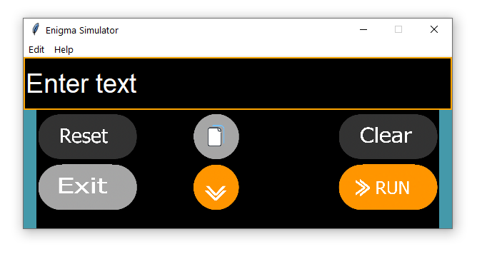
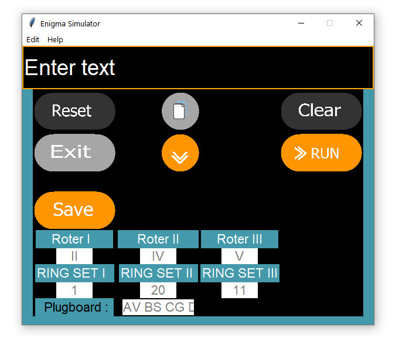

```
When I wrote this, only God and I understood what I was doing. Now, only God knows.
```
<div align="center">
  <a href="https://github.com/dineshyadav3169/"></a>
  <br>
  <h1>Enigma Machine Simulator</h1>
  <sub>Built with ❤︎ by
  <a href="https://github.com/dineeshyadav3169">Dinesh Kumar</a>
	</sub>
</div>

---

[](https://github.com/dineshyadav3169/enigma-machine-simulator-python/)[](https://github.com/dineshyadav3169/enigma-machine-simulator-python/archive/master.zip) [](https://github.com/dineshyadav3169/enigma-machine-simulator-python/issues)

# ⚡ Enigma Simulator

### 🎰 Enigma Machine Simulator by [Dinesh Kumar](https://github.com/dineshyadav3169)

<div align="center">
  <br>
  
  
  <br>
</div>

### Features :sparkles:

:heart: **Easy and minimal**: Crafted with minimalistic UI design

:electric_plug: **Real-time result**: Type and Run..

:zap: **Change Rotor, Ring, Plugboard and Reflector Settings**: Click on expand button to edit settings!

---

## Requirements

* [py-enigma](https://bitbucket.org/bgneal/enigma/)
* Tkinter
---
<h1>Questions ?</h1>
<br>
<a href="https://instagram.com/thedineshyadav"></a>
